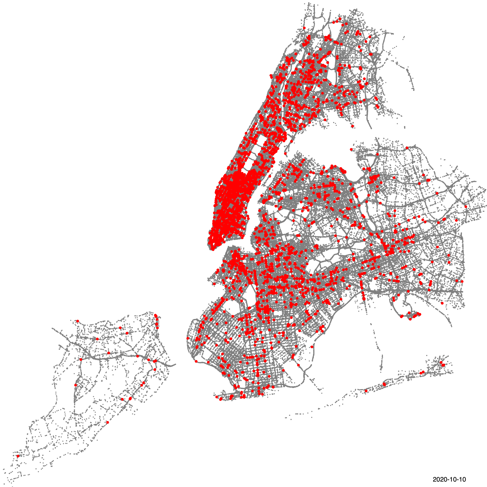

# Disparities in Police (NYPD) Deployment Patterns

Code to reproduce results in "Detecting disparities in police deployments using dashcam data" (2023) by Matt Franchi, J.D. Zamfirescu-Pereira, Wendy Ju, and Emma Pierson. To appear in ACM FAccT '23. 

## Reproducing results 
1. **Virtual environment setup.** Our code is run within a conda environment, with all analysis performed on a Linux Ubuntu HPC resource. This environment can be reproduced by running `pip install -r core_packages.txt`, inside or outside a conda environment; this environment was tested using python 3.11. 

2. **Downloading data.** We are hoping to release data from the project, pending approval from Nexar. See below for the release plan: 
    - *Aggregated bootstrapping results.* These JSON files are the smallest filesize, and provide the ability to regenerate our paper's plots. (DONE)
    - *Textual metadata.* This ~28GB CSV file contains a row for each image in our dashcam dataset, annotated with demographic, temporal, and geographic features that enable analysis. (WIP)
    - *Raw image data.* We are coordinating with Cornell to figure out a hosting scheme for the raw image data, with clocks in at over 10 TB. If you are interested in acquiring this dataset, or a subset of the dataset, please reach out. (WIP)

3. **Generating results for paper**. Figures and results can be reproduced by running `bootstrapped_plots.ipynb`. See below for details. 

*For any issues with reproducing results, getting code to work, etc., please open a GitHub Issue.* 

## Public datasets we used as additional metadata for each dashcam image. 
### [NYPD Crime Data (*NYPD Complaint Data Historic*)](https://data.cityofnewyork.us/Public-Safety/NYPD-Complaint-Data-Historic/qgea-i56i)
The NYPD Complaint Data Historic dataset is a collection of records related to complaints received by the New York City Police Department (NYPD) from civilians. This dataset includes information about the type of complaint, the location where the incident occurred, and the date and time of the complaint.

The data in this dataset covers a period of several years, from 2006 to the present day, and is updated regularly. It contains a wealth of information that can be used to study crime trends, identify areas where crime is more prevalent, and to monitor the effectiveness of the NYPD's response to complaints.

Some of the specific types of complaints included in this dataset are related to incidents such as assault, robbery, burglary, and noise complaints. Each record in the dataset contains detailed information about the complaint, including the complaint type, the location where the incident occurred, and the status of the complaint (whether it is still under investigation or has been resolved).

We filter the dataset to only include crimes from our dataset's period of coverage (March-November 2020), and also only analyze felony-level crimes. 

### [Median Household Income @ CBG Level (*2020 ACS 5-year Estimates*)](https://data.census.gov/table?q=B19013&g=050XX00US36005$1500000,36047$1500000,36061$1500000,36081$1500000,36085$1500000&tid=ACSDT5Y2021.B19013)
The census table B19013 is a dataset that provides information about the income levels of people living in the block groups of New York City. Block groups are small geographic areas used by the U.S. Census Bureau to divide larger census tracts into smaller, more manageable units.

This dataset is derived from the American Community Survey (ACS), a yearly survey conducted by the U.S. Census Bureau that collects data on various demographic and socioeconomic characteristics of households across the country. The B19013 table specifically provides data on median household income, which is the middle point of all household incomes in a given block group.

The dataset provides a wealth of information on income levels across New York City, which can be used by researchers, policymakers, and community organizations to better understand economic disparities and plan programs to address them. For example, the data could be used to identify neighborhoods with low median incomes, which may be in need of affordable housing or job training programs.

It is important to note that while median household income is a useful measure of overall economic well-being, it does not capture the full range of income levels in a given block group. Additionally, the data is subject to sampling error, as it is based on survey responses from a sample of households rather than a complete count of all households in a given area. However, despite these limitations, the census table B19013 remains a valuable resource for anyone interested in understanding the economic landscape of New York City.

### [NYPD Precinct Boundaries (*GIS Shapefile*)](https://data.cityofnewyork.us/Public-Safety/Police-Precincts/78dh-3ptz)
The NYCOpenData Police Precincts GIS Boundaries Map is an interactive map that displays the geographic boundaries of the police precincts in New York City. This map is made available by the New York City Open Data platform, which provides access to a wide range of publicly available data related to various aspects of life in New York City.

The police precincts in New York City are the local law enforcement units responsible for maintaining public safety and enforcing the law within a defined geographic area. There are 77 police precincts in total, each with its own specific boundaries.The GIS boundaries map allows users to export the data in a variety of formats, including shapefiles and geoJSON files, which can be used with GeoPandas. These data files contain the geographic boundaries of each police precinct, allowing users to perform a wide range of spatial analysis tasks.

For example, users could use GeoPandas to calculate the total area covered by each precinct, or to identify the overlap between different precinct boundaries. They could also use the data to perform spatial joins with other datasets, such as crime data, to identify areas with high crime rates in relation to the location of each precinct.

By making this data available for export, the NYCOpenData Police Precincts GIS Boundaries Map provides a valuable resource for those looking to analyze the spatial distribution of law enforcement resources in New York City. It allows users to explore and analyze the data in a way that is flexible and customizable, and can be used to gain insights into a wide range of important issues related to public safety and law enforcement.

### [Census Grouping Boundaries, NYC Boundaries (*GIS Shapefiles*)](https://www.nyc.gov/site/planning/data-maps/open-data/census-download-metadata.page)
The NYCPlanning Census page is a website that provides a wealth of information on the population and demographic characteristics of New York City. This website is maintained by the New York City Department of City Planning, and is designed to help researchers, policymakers, and the general public better understand the changing demographics of the city.

One of the valuable features of this website is the availability of GIS shapefiles for Census Tracts, Census Blocks, and Neighborhood Tabulation Areas. These are all small, relatively permanent subdivisions of a county or city, defined by the U.S. Census Bureau for the purpose of collecting and analyzing demographic data.

GIS shapefiles are a type of data file that can be used with Geographic Information Systems (GIS) software, such as ArcGIS or QGIS, to perform spatial analysis tasks. These shapefiles provide detailed geographic information about each subdivision, including its boundaries and geographic coordinates.

By providing access to these shapefiles, the NYCPlanning Census page allows users to perform a wide range of spatial analysis tasks related to population and demographic data. For example, users could use GIS software to create maps that show the racial and ethnic composition of different Census Tracts or Neighborhood Tabulation Areas in the city, or to identify areas with high concentrations of poverty or unemployment.

## Model Training - Compute Resources 
To train our YOLOv7 object classifier, we utilized the following hardware: 
- 4x RTX A6000 GPU
- 256GB RAM 

This allowed us to use a batch size of 40. 

